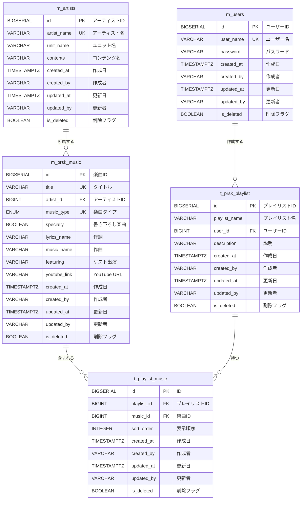

# プロセカ楽曲リストER図

```mermaid
erDiagram
    m_users ||--o{ t_prsk_playlist : "作成する"
    m_artists ||--o{ m_prsk_music : "所属する"
    m_prsk_music ||--o{ t_playlist_music : "含まれる"
    t_prsk_playlist ||--o{ t_playlist_music : "持つ"

    m_users {
        BIGSERIAL id PK "ユーザーID"
        VARCHAR user_name UK "ユーザー名"
        VARCHAR password "パスワード"
        TIMESTAMPTZ created_at "作成日"
        VARCHAR created_by "作成者"
        TIMESTAMPTZ updated_at "更新日"
        VARCHAR updated_by "更新者"
        BOOLEAN is_deleted "削除フラグ"
    }

    m_artists {
        BIGSERIAL id PK "アーティストID"
        VARCHAR artist_name UK "アーティスト名"
        VARCHAR unit_name "ユニット名"
        VARCHAR contents "コンテンツ名"
        TIMESTAMPTZ created_at "作成日"
        VARCHAR created_by "作成者"
        TIMESTAMPTZ updated_at "更新日"
        VARCHAR updated_by "更新者"
        BOOLEAN is_deleted "削除フラグ"
    }

    m_prsk_music {
        BIGSERIAL id PK "楽曲ID"
        VARCHAR title UK "タイトル"
        BIGINT artist_id FK "アーティストID"
        ENUM music_type UK "楽曲タイプ"
        BOOLEAN specially "書き下ろし楽曲"
        VARCHAR lyrics_name "作詞"
        VARCHAR music_name "作曲"
        VARCHAR featuring "ゲスト出演"
        VARCHAR youtube_link "YouTube URL"
        TIMESTAMPTZ created_at "作成日"
        VARCHAR created_by "作成者"
        TIMESTAMPTZ updated_at "更新日"
        VARCHAR updated_by "更新者"
        BOOLEAN is_deleted "削除フラグ"
    }

    t_prsk_playlist {
        BIGSERIAL id PK "プレイリストID"
        VARCHAR playlist_name "プレイリスト名"
        BIGINT user_id FK "ユーザーID"
        VARCHAR description "説明"
        TIMESTAMPTZ created_at "作成日"
        VARCHAR created_by "作成者"
        TIMESTAMPTZ updated_at "更新日"
        VARCHAR updated_by "更新者"
        BOOLEAN is_deleted "削除フラグ"
    }

    t_playlist_music {
        BIGSERIAL id PK "ID"
        BIGINT playlist_id FK "プレイリストID"
        BIGINT music_id FK "楽曲ID"
        INTEGER sort_order "表示順序"
        TIMESTAMPTZ created_at "作成日"
        VARCHAR created_by "作成者"
        TIMESTAMPTZ updated_at "更新日"
        VARCHAR updated_by "更新者"
        BOOLEAN is_deleted "削除フラグ"
    }
```
